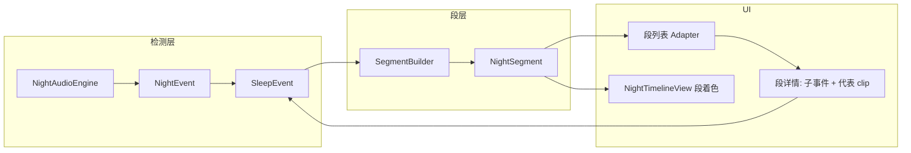

# sleep-desk 段式展示 / 聚合方案（v1 可落地）

> **目标**：在检测层仍产出细粒度 `NightEvent` / `SleepEvent` 的前提下，增加 **Segment（段）** 作为会话 UI 主列表与统计的聚合单元，减少碎事件列表；每段只挂少量 **代表 clip**（配额筛选），而非每个事件都展示播放入口。  
> **检测管线**：见 [`audio-algo.md`](audio-algo.md)（算法字段与节流不变）。睡眠声音/周期语义见 [`sleep-sounds-and-cycles.md`](sleep-sounds-and-cycles.md)。  
> **包名**：`com.i3u8.sleepdesk`。本方案为文档级设计，实现落在主应用（`data` / `ui`），**不改**引擎检测语义。

---

## A. 目标与分层

| 层 | 职责 | 现状 / 不变 |
| --- | --- | --- |
| **检测层** | `NightAudioEngine` → `NightEvent` → `SessionStore.appendNightEvent` → `SleepEvent` | 扁平列表；字段见 `NightModels.kt` / `Models.kt`；`audio-algo.md` 不变 |
| **引擎节流** | `snoreMergeMs`、`snoreClipIntervalMs`、`allowClipThisHour`（当前硬编码 **120/类型/小时**） | 控制「是否落盘 clip / 是否发事件」，与段无关 |
| **段层（Segment）** | 会话展示、时间线着色、Home/详情统计的 **聚合视图** | **新建**；不替代检测，不删底层事件 |
| **UI** | 现 `EventsAdapter`、`NightTimelineView`、Home 直接 `countByType` | 主列表改为段；点进段再看子事件 / 代表 clip |

**原则**：Segment 是 **视图 + 索引**，不是第二套检测结果。底层 `SleepEvent` 完整保留，便于调试、导出与算法回放。

---

## B. Segment 定义（数据模型草图）

对齐现有字段命名：`SleepEvent` 用 `timeMs`/`endMs`/`type`/`peakLevel`/`confidence`/`clipRelativePath`；`NightEvent` 用 `startMs`/`endMs`/`features["peakDb"]` 等。段层统一用 `startMs`/`endMs`。

```kotlin
// 建议包：com.i3u8.sleepdesk.data（或 .audio 旁独立 segment 包）
data class NightSegment(
    val id: String,
    val sessionId: String,
    val startMs: Long,
    val endMs: Long,
    /** 段主标签：SNORE / COUGH / SPEECH / NIGHT_WAKE_SOUND / ABNORMAL / MIXED 等 */
    val primaryLabel: String,
    /** 各类型事件计数（含 ENV_NOISE 若被并入统计；FALSE_TRIGGER 默认不计） */
    val labels: Map<String, Int>,
    /** 指向底层 SleepEvent.id；一个 event 只属于一个段 */
    val eventIds: List<String>,
    /** 配额选出的代表片段相对路径（同 clipRelativePath 语义） */
    val representativeClipPaths: List<String>,
    val peakConfidence: Float = 0f,
    val peakDb: Double = 0.0,
    /** 段内 SNORE 覆盖分钟数（按事件并集或简单 sum(end-start)/60s，v1 可简化） */
    val snoreMinutes: Float = 0f,
    /** 非音频辅信号标记，如 SCREEN_ON / CHARGING_ON；不参与 primaryLabel 竞争 */
    val auxFlags: List<String> = emptyList(),
    val algoVersion: String? = null,
    val segmentVersion: String = "seg-v1"
)

data class SegmentConfig(
    val segmentBucketMs: Long = 300_000L,       // 5 min 展示格骨架
    val snoreMergeGapMs: Long = 90_000L,        // 同类型粘连 gap（SNORE）
    val burstMergeGapMs: Long = 45_000L,        // COUGH / SPEECH / NIGHT_WAKE_SOUND
    val abnormalMergeGapMs: Long = 30_000L,     // ABNORMAL
    val maxSegmentMs: Long = 20 * 60_000L,      // 防超长鼾段撑爆 UI
    val minEventsToShow: Int = 1,
    val clipsPerSegment: Int = 2,
    val clipsPerSnoreSegment: Int = 2,
    val clipsPerBurstSegment: Int = 2,
    val maxClipsPerSegment: Int = 3,            // 长鼾段 duration≥10min 可 +1
    val longSnoreForExtraClipMs: Long = 10 * 60_000L,
    val minClipSpacingMs: Long = 60_000L,       // 鼾段代表 clip 最小间隔
    val preferEventsWithClip: Boolean = true,
    val mixedSecondaryRatio: Float = 0.40f,     // 次要类型 ≥ 主类型 40% → MIXED
    val mixedMinTypeKinds: Int = 3
)
```

**持久化建议（v1）**：会话 JSON 增加并列数组 `segments`（或独立 `segments/{sessionId}.json`）。字段与上表一致；`eventIds` / `representativeClipPaths` 为字符串列表即可。进行中会话可不写盘，结束时物化。

---

## C. 分段规则（可落地默认）

### C.1 推荐策略：先 bout 粘连，再对齐桶做展示格

**优先级（写死实现顺序）**：

1. **过滤**：从会话 `events` 取出参与成段的音频事件（见 C.2）；非音频进 `auxFlags` 候选池。
2. **同类型粘连成 bout（变长）**：按 `timeMs` 排序；相邻且 **主类型相同**、gap ≤ 类型对应 `mergeGapMs` 则并入同一 bout。  
   - gap = 后事件 `timeMs` − 前事件 `endMs`（若 `endMs < timeMs` 则用 `timeMs`）。  
   - **可跨固定桶边界**。
3. **切超长**：若 bout 时长 > `maxSegmentMs`，按时间切成多段（尽量在事件边界切，避免切断单事件）。
4. **对齐展示桶（固定时间桶骨架）**：以会话 `sessionStartMs` 为原点，`bucketIndex = (t - sessionStartMs) / segmentBucketMs`。  
   - 每个 bout 映射为一段（或按桶切开后的子段）：段的 `startMs`/`endMs` = bout 内首末事件边界，并 **裁剪到** `[sessionStartMs, sessionEndMs]`。  
   - 桶主要用于时间线「格子」着色与空档留白；**不要**先硬切 5 分钟再丢粘连信息。
5. **空桶**：桶内无音频事件 → **不生成段**（时间线留白）。
6. **会话裁剪**：段边界 `coerceIn(sessionStartMs, sessionEndMs)`；进行中会话 `sessionEndMs = now`。

> **为何推荐「先粘连再对齐桶」**：引擎已有短窗 `snoreMergeMs=6s`，段层需要更长的「鼾 bout / 咳嗽簇」；若先按 5 分钟硬切，会把跨界连续鼾声拆成多个碎段，UI 收益差。

### C.2 哪些类型成段

| 类型 | 成段？ | mergeGap |
| --- | --- | --- |
| `SNORE` | 是 | `snoreMergeGapMs = 90_000` |
| `COUGH` / `SPEECH` / `NIGHT_WAKE_SOUND` | 是 | `burstMergeGapMs = 45_000` |
| `ABNORMAL` | 是（优先告警展示） | `abnormalMergeGapMs = 30_000` |
| `ENV_NOISE` | **不单独成段**；可计入会话级噪声统计 | — |
| `FALSE_TRIGGER` | **不入段、不入统计** | — |
| `SCREEN_*` / `CHARGING_*` / `LIGHT_SPIKE` | 不成段；落入时间重叠段的 `auxFlags`（可选） | — |

同一 bout 粘连规则按 **事件自身 type** 匹配；混合类型不在粘连阶段合并——混合在 **标签阶段**（§D）用「桶内/邻近不同 bout 的展示合并」处理：

- **v1 简化**：不同 type 的 bout **各自成段**；若两段时间重叠或 gap < `burstMergeGapMs` 且都非空，UI 可并排显示，或在物化时合并为 `MIXED` 段（推荐物化时合并重叠/紧邻异型 bout → 一个 `MIXED` 段，`labels` 保留各类型计数）。

### C.3 默认参数表（常量名）

| 常量名 | 默认值 | 说明 |
| --- | --- | --- |
| `segmentBucketMs` | `300_000`（5 min） | 展示格骨架；可配置 3/10 min（`180_000` / `600_000`） |
| `snoreMergeGapMs` | `90_000` | 相邻 SNORE 粘连 |
| `burstMergeGapMs` | `45_000` | COUGH / SPEECH / NIGHT_WAKE_SOUND |
| `abnormalMergeGapMs` | `30_000` | ABNORMAL |
| `maxSegmentMs` | `1_200_000`（20 min） | 超长则切段 |
| `minEventsToShow` | `1` | 至少 1 个有效音频事件才成段 |

---

## D. 段标签定义

### D.1 `primaryLabel` 选取（加权）

对段内各类型计 `score = eventCount * typeWeight`，再比较：

| 类型 | `typeWeight` | 备注 |
| --- | --- | --- |
| `ABNORMAL` | `10` | **优先告警**：只要存在且 count≥1，可直接定为 `ABNORMAL`（除非产品要求 MIXED 覆盖） |
| `SNORE` | `3` | 主睡眠声 |
| `NIGHT_WAKE_SOUND` | `2.5` | |
| `COUGH` | `2.5` | |
| `SPEECH` | `2` | |
| `ENV_NOISE` | `0` | 不成段主标签 |

并列时：取 **count 最大**；再并列取段内该类型 **peak confidence** 最高者。

### D.2 `MIXED` 判定

在选出「准主类型」后，若满足任一条件则 `primaryLabel = MIXED`：

- 次要类型事件数合计 ≥ 主类型 count × `mixedSecondaryRatio`（默认 **0.40**）；或  
- 段内有效类型种类 ≥ `mixedMinTypeKinds`（默认 **3**）。

`ABNORMAL` 存在时：v1 建议 **仍标 `ABNORMAL`**（告警优先），副标题列出其它类型；若产品要「异常+鼾」统一混合，可改为 `MIXED` 并在 `auxFlags` 加 `HAS_ABNORMAL`。

### D.3 展示文案

| `primaryLabel` | 文案 |
| --- | --- |
| `SNORE` | 鼾声段 |
| `NIGHT_WAKE_SOUND` / `COUGH`（可合并展示） | 夜醒/咳嗽 |
| `SPEECH` | 说话 |
| `MIXED` | 混合 |
| `ABNORMAL` | 异常 |

**副标题示例**：`3 次鼾 · 1 次咳嗽 · 2 clips`  
格式：按 `labels` 中 count>0 的类型拼接「N 次{短名}」，再加 `representativeClipPaths.size` + ` clips`。

短名建议：鼾 / 咳 / 说话 / 夜醒 / 异常（与 `EventLabels` 中文资源对齐时可复用 string）。

---

## E. merge / 去重

| 规则 | 说明 |
| --- | --- |
| 引擎层 snore merge | `snoreMergeMs`（当前默认 **6_000**）已在检测侧抑制过密鼾事件；**段层不要再删底层 `SleepEvent`** |
| 段只是视图/索引 | `eventIds` 引用，不改 `SessionStore` 事件数组顺序与内容 |
| 段内 clip 去重 | 同一 `clipRelativePath` 在 `representativeClipPaths` 只保留一次 |
| 段内 event 去重 | 同一 `eventId` 只挂一次 |
| 跨段归属 | 一个 event **只属于一个段**；按 `timeMs`（=`NightEvent.startMs`）落入 bout / 段 |
| 非音频事件 | `SCREEN_*` / `CHARGING_*` / `LIGHT_SPIKE` → 时间落在段 `[startMs,endMs]` 内则写入 `auxFlags`；**不参与** `primaryLabel` 竞争 |

---

## F. 每段 clip 配额（核心）

**目标**：列表只播代表音，不是每个 `NightEvent` 都出播放按钮。

### F.1 默认配额

| 常量名 | 默认 | 说明 |
| --- | --- | --- |
| `clipsPerSegment` | `2` | 普通段 |
| `clipsPerSnoreSegment` | `2` | 鼾段：优先 **首事件 clip + 峰值/中段** |
| `clipsPerBurstSegment` | `2` | 咳嗽/夜醒：最高 confidence + 最高 peakDb |
| `maxClipsPerSegment` | `3` | 上限；鼾段 `duration ≥ longSnoreForExtraClipMs`（10 min）时可从 2→3 |
| `minClipSpacingMs` | `60_000` | 鼾段代表 clip 最小时间间隔；不足则逐步放宽（→30s→0） |
| `preferEventsWithClip` | `true` | 只从有 `clipRelativePath` 的事件里选；不够则段仍展示，**不强行补编码** |

### F.2 选取算法

1. 候选 = 段内 `clipRelativePath` 非空的事件（已对 path / id 去重）。  
2. 排序键：`score = confidence * 0.6 + normPeakDb * 0.4`  
   - `normPeakDb`：将 `peakLevel`（来自 `SleepEvent.peakLevel` / `features["peakDb"]`）线性映射到约 `[0,1]`（可用段内 min-max；单事件则 1）。  
   - `SNORE` 额外：距离段中心 `|timeMs - (startMs+endMs)/2|` 更近者打破平局（中段优先）。  
3. **时间分散**：贪心选取时，与已选 clip 的 `|Δt| ≥ minClipSpacingMs`；取不满则放宽间隔。  
4. 鼾段特殊：若配额≥2，先固定选 **时间最早且有 clip** 的一条，再按 score+分散选其余。  
5. burst 段：按 score 取 Top-K，同样施加分散（间隔可放宽到 `burstMergeGapMs`）。

### F.3 落盘策略（二选一，v1 推荐 A）

| 方案 | 行为 | 适用 |
| --- | --- | --- |
| **A（推荐 v1）** | 检测时仍按引擎 `snoreClipIntervalMs` + `allowClipThisHour` 存 clip；段层 **只挑选引用**，不改、不删文件 | 实现简单，无引用计数 |
| **B（v1.1）** | 段物化后异步删除未入选 clip 以省空间；需 path 引用计数（多段/导出可能共用） | 存储紧时再做 |

---

## G. 与 NightEvent 关系

```text
SleepSession
  └─ SleepEvent[]          ← 细粒度（检测层；含音频 + 辅信号）
        │
        ▼
  SegmentBuilder.build()
        │
        ▼
  NightSegment[]           ← 粗粒度（UI 主列表 / 统计 / 时间线着色）
        ├─ eventIds[]      → 回指 SleepEvent
        └─ representativeClipPaths[]  → 子集引用
```



**交互**：时间线按段着色（也可用段中点打标）；点击段 → BottomSheet 展示副标题统计、代表 clip 播放、可选展开全部子事件。

---

## H. Kotlin 接口草图

```kotlin
object SegmentBuilder {
    fun build(
        sessionId: String,
        sessionStartMs: Long,
        sessionEndMs: Long,
        events: List<SleepEvent>,
        config: SegmentConfig = SegmentConfig()
    ): List<NightSegment>
}

// SegmentConfig / NightSegment 见 §B
```

### H.1 何时 build

| 时机 | 行为 |
| --- | --- |
| **进行中** | UI / `HomeFragment` 对当前会话 **即时** `build`（可节流，如每 30s 或每新增 N 事件） |
| **结束会话** | `SessionStore` 停止会话时 **物化**写入 JSON，历史页直接读段 |
| 历史已物化 | 若 `segmentVersion` 升级，可懒重建并回写 |

推荐：**结束时物化 + 进行中即时 build**。

### H.2 统计迁移（建议）

- Home「鼾次数」等：可改为 **段数** 或保留 **事件数** 并注明；推荐并列：`鼾段 N · 事件 M`。  
- `SleepSession.countByType` 仍基于事件，段统计用 `segments.count { primaryLabel == ... }`。

---

## I. 与现有引擎节流的关系

| 机制 | 位置 | 作用 | 与段层 |
| --- | --- | --- | --- |
| `snoreMergeMs` | `AudioAlgoConfig`，默认 `6_000` | 过密鼾事件直接 return（仍可能因 clip 间隔再发） | 段层 **不重复** 做短窗删除 |
| `snoreClipIntervalMs` | 默认 `5 * 60_000` | 同一鼾 bout 内 clip 落盘间隔 | 段配额是 **展示二次筛选** |
| `allowClipThisHour` | `NightAudioEngineImpl`，**硬编码 `n < 120`** | 每类型每小时 clip 上限 | 保留；段只引用已有 path |

**可选（建议主应用顺手改）**：将小时上限从 `120` 降为更合理默认，例如 **每类型每小时 30**（抽成 `AudioAlgoConfig.maxClipsPerTypePerHour = 30`）。此为引擎侧存储友好改动，**与段方案独立**，标可选。

---

## 主应用接入 4 步（摘要）

1. **数据**：新增 `NightSegment` / `SegmentConfig` / `SegmentBuilder`（按本文草图）；`SessionStore` 结束会话时物化 `segments`。  
2. **UI 列表**：`EventsAdapter` 旁增 `SegmentsAdapter`（或改造）；Home / 会话详情主列表绑段；点进段再 `EventDetail` / 多 clip 播放。  
3. **时间线**：`NightTimelineView` 增加按段绘制 API（或把段展开为着色区间）；点击回调段或代表事件。  
4. **统计**：Home / History 在事件计数旁增加段计数或改为以段为主文案；进行中会话定时/增量 `SegmentBuilder.build`。

---

## 成功标准（本文件）

- [x] 覆盖 A–I，含默认参数表与常量名  
- [x] 明确检测层不变、段为展示聚合  
- [x] clip 配额算法与落盘策略 A（v1）  
- [x] 与 `snoreMergeMs` / `snoreClipIntervalMs` / `allowClipThisHour` 关系写清  

**可交给主应用接入**
